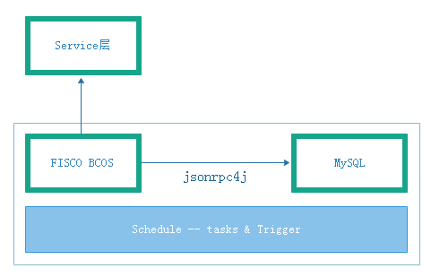

# yezzi_browser1.0 文档

## 一、产品简介

#### 1.1 基本描述

###### yezzi_browser在fisco-bcos-browser基础上进行修改，和fisco-bcos-browser一样适配FISCO BCOS 2.0+版本

区块链浏览器将区块链中的数据可视化，并进行实时展示。方便用户以Web页面的方式，获取当前区块链中的信息。而修改后的浏览器主要增加区块链中个性化数据的展示，以满足各种业务需求和区块链中交易的监管。

#### 1.2 主要功能模块

媒体素材链的主要功能模块有：区块和交易一揽；业务数量统计；各种交易趋势；等等（正在考虑新增其他特性）

##### 1.2.1 区块链信息展示模块

和原版一样，主要展示了链上群组的具体信息，这些信息包括：概览信息，区块信息，交易信息。

##### 1.2.2 业务数据统计

包括：上链素材统计；图片交易数量；图片侵权数量；图片确权总数；交易图片增长趋势；确权图片量增长趋势；

## 二、安装说明

#### 2.1 群组搭建

按照[FISCO BCOS](https://fisco-bcos-documentation.readthedocs.io/zh_CN/latest/docs/installation.html)标准的搭建方式搭链即可

#### 2.2 部署说明

参考[fisco-bcos-browser文档](https://fisco-bcos-documentation.readthedocs.io/zh_CN/latest/docs/browser/browser.html)

###### 区别：

###### 1.后端搭建步骤中，在gradle build之前需要改动start.sh,在CLASSPATH一行加入conf_template/: 目的是在build.gradle中重写的jar命令中将resources中文件复制到conf_template中而没放到conf中，即使编译过，因为log4j2.xml缺失，运行dist中复制后的start.sh时会出现找不到该文件而报错，无法运行。需要注意的是，必须在编译Jar包之前修改start.sh文件，在dist目录存在时，gradle build命令不会再对dist中的内容进行修改，即使里面缺少东西也不会按照gradle里面写的步骤进行下去。

###### 2.运行前根目录下若有dist文件夹，先运行gradle clean 再重新gradle build

#### 2.3 问题排查

##### 2.3.1 主机无法复制文件和文字到虚拟机

解决方法1：安装vmware tools,并在设置中勾选上允许客户端和虚拟机。

解决方法2：在插入u盘的时候虚拟机会提示是否连接虚拟机，选是，后面按提示走就可以把u盘文件复制过去

##### 2.3.2 安装vmware tools的选项显示灰色的解决方法

在虚拟机设置-硬件-   CD/DVD   CD/DVD2   软盘   中都勾选住使用物理驱动器-自动检测，之后重启即可

##### 2.3.3 mysql root密码忘记怎么办？

1.关闭Mysql所有服务

2.修改mysql的登录设置,一般在 /etc/my.cnf中，在mysqld段中加上一句skip-grant-tables

3.重启mysql

4.使用数据库mysql : use mysql;

5.改root密码(123456) update user set password = password('123456') where user = 'root';

有的版本的Mysql需要用 update user set authentication_string = password('123456') where user = 'root';

6.将mysql登录设置改回来

7.重启mysql

##### 2.3.4 连接mysql时出现 can not connect to local mysql through socket

可能的解决方法1：service mysqld start

可能的解决方法2：完善mysql配置文件，/etc/my.cnf中添加[client]和[mysqld]选项，并且使这两个选项下的socket和default的参数值和[mysqld]中的一样

##### 2.3.5 gradle项目编译时出现 could not find method annotationProcessor() for arguments

多半是gradle的问题，重新配置下gradle试试

##### 2.3.6 使用数据库时出现OperationError:(1698,"Access denied for user ***")

数据库密码错了，看下配置文件或登陆下试试

##### 2.3.7 安装Mysql-python时出现问题：/usr/bin/ld: cannot find -lssl

一般是血少链接库文件 使用 apt-get install lib***-dev

##### 2.3.8 有python2.X的环境却没有pip？

配置apt源，重新下载python和pyhon-pip

# 三、技术文档

#### 3.1 后端文件目录

.gradle：gradle缓存

.idea：idea缓存 

（dist）：编译后产生的目录

gradle：Gradle可以在没有安装Gradle的情况下使用，这时候就需要Gradle Wrapper了。Gradle Wrapper其实就是一个脚本文件，它会在没有安装Gradle的情况下为我们下载Gradle，之后我们就可以使用gradlew命令，像使用gradle一样来使用Gradle了。

log：若从idea直接启动项目，日志文件将产生在这里

src：项目文件

temp：临时文件

build.gradle：gradle是基于jvm的构建工具，build.gradle主要配置软件版本信息、引用库的配置，以及编译所需的配置

gradlew   gradlew.bat   :   linux和windows下运行gradlew命令使用的脚本

start.sh   stop.sh   status.sh   :   运行和停止脚本，会在项目编译后复制到dist目录中，项目就由其控制运行和停止

#### 3.2 后端项目解析

##### 3.2.1 主要逻辑


##### 3.2.2 数据同步



##### 3.2.3 涉及到的注解

```java
@SpringBootApplication
@EnableTransactionManagement
@MapperScan

@RestController
@RequestMapping
@GetMapping   @PostMapping   @PutMapping   @DeleteMapping

@Data
@Autowired
@Override

@Repository

@Service
@Transactional

@Configuration
@ConfigurationProperties

@Slf4j

@Component
@EnableScheduling

@SuppressWarnings

```

##### 3.2.4 涉及到的组件

```java
spring组件：
	"org.springframework:spring-core:$spring_version"
	"org.springframework:spring-beans:$spring_version"
	"org.springframework:spring-context:$spring_version"
	"org.springframework:spring-tx:$spring_version"
	"org.springframework:spring-jdbc:$spring_version"
	"org.springframework:spring-web:$spring_version"
	"org.springframework:spring-webmvc:$spring_version"
	
    "org.springframework.boot:spring-boot-starter-web:1.5.9.RELEASE",
	"org.springframework.boot:spring-boot-autoconfigure:1.5.9.RELEASE",
	"org.springframework.boot:spring-boot-configuration-processor:1.5.9.RELEASE",
	"org.springframework.boot:spring-boot-starter-log4j2:1.5.9.RELEASE"
mysql组件：
	'org.mybatis:mybatis:3.2.8',
	'org.mybatis.spring.boot:mybatis-spring-boot-starter:1.3.1',
	'mysql:mysql-connector-java:5.1.30',
io组件：
	'commons-io:commons-io:2.6',
	'commons-fileupload:commons-fileupload:1.4'
其他组件：
jsonrpc4j：1.5.1
fastjson：1.2.29
lombok:1.18.2
log4j2
```

##### 3.2.5 部分代码片段解析

###### 1.SchedulerConfig.java

```java
taskRegistrar.addTriggerTask(() -> schedulerService.handleBlockChainInfo(),
            (context) -> new CronTrigger(constants.getCronBlockChainInfo())
                        .nextExecutionTime(context));
```

箭头函数。Lambda表达式的本质只是一个语法糖,由编译器推断并帮你转换包装为常规的代码,因此你可以使用更少的代码来实现同样的功能。

addTriggerTask(task, trigger)   参数是两个函数，前一个参数是要执行的任务，后一个参数是触发条件。() -> schedulerService.handleBlockChainInfo() 是箭头函数，表示无参数传递，返回值为schedulerService.handleBlockChainInfo() 。下一个函数代表传入一个箭头函数：context为参数，nextExecutionTime为返回函数，确定执行周期。

###### 2.简易流程分析（以拿区块链数据为例）

controller:

注释写上方法名，参数，返回。继承抽象类BaseController(进行一些参数检查和错误处理)。之后规定http get方法，/{groupId}的写法是对应url中的/fisco-bcos-browser/home/blockChainInfo/1中的"1"，将地址中的数字直接拿出来而不需要再用参数。其使用@PathVariable绑定URI模板变量值，请求url中的动态参数。得到请求后直接传给service层的getBlockChainInfo函数并等待返回值。

需要注意的是，返回的值是自定义的BaseResponse类型，而是统一放到response对象的数据。该对象是一个bean由@Data注解修饰的数据域，内含状态码、状态消息、值域。有的服务返回BasePageResponse用于返回分页数据,和BaseResponse区别多了个totalCount值表示有几个值（一般是一个对象组成的list）被返回。这样做的好处是有利于前后端分离开发，更规范前端易解析。

```java
@RestController
@RequestMapping(value = "home")
public class BlockChainInfoController extends BaseController {

    @Autowired
    BlockChainInfoService blockChainInfoService;

    /**
     * getBlockChainInfo.
     * 
     * @param groupId groupId
     * @return
     */
    @GetMapping("/blockChainInfo/{groupId}")
    public BaseResponse getBlockChainInfo(@PathVariable("groupId") int groupId) {
        BaseResponse response = blockChainInfoService.getBlockChainInfo(groupId);
        return response;
    }
}
```

service:

新建BaseResponse对象。状态码对应success，之后直接调用mapper的方法调用数据库，将返回值放在response对象的data中。

```java
@Service
public class BlockChainInfoService {
    @Autowired
    BlockChainInfoMapper blockChainInfoMapper;
    @Autowired
    NodeMapper nodeMapper;

    /**
     * getBlockChainInfo.
     * 
     * @param groupId groupId
     * @return
     */
    public BaseResponse getBlockChainInfo(int groupId) {
        BaseResponse response = new BaseResponse(ConstantCode.SUCCESS);
        BlockChainInfo tbBlockChainInfo = blockChainInfoMapper.getBlockChainInfo(groupId);
        response.setData(tbBlockChainInfo);
        return response;
    }
}
```

mapper:

在/resources/mapper下的xml中用sql语言定义好数据库操作，在mapper文件中定义接口函数，就可以调用数据库了。

```java
    @Repository
public interface BlockChainInfoMapper {
    BlockChainInfo getBlockChainInfo(@Param(value = "groupId") int groupId);
    }
```

```mysql
    <mapper namespace="org.bcos.browser.mapper.BlockChainInfoMapper">
    <select id="getBlockChainInfo" resultType="org.bcos.browser.entity.dto.BlockChainInfo">
        select <include refid="ALL_COLUMN" />
        from tb_blockChainInfo_#{groupId}
    </select>
```

数据库对应的数据：


###### 3.数据同步流程代码分析

写好rpc通信工具，以便使用json-rpc api调用

```java
@Slf4j
@Component
public class Web3jRpc {

    @Autowired
    NodeMapper nodeMapper;

    /**
     * rpcRequest.
     * 
     * @param groupId groupId
     * @param methodName rpc method
     * @param params params
     * @return
     */
    public Object rpcRequest(int groupId, String methodName, Object[] params) {
        Object object = null;

        List<Node> nodeList = nodeMapper.getManualNode(groupId);
        if (nodeList == null || nodeList.size() == 0) {
            log.warn("there are not manually added nodes");
            return null;
        }

        int nodeSize = nodeList.size();
        Random random = new Random();
        List<Integer> indexList = new ArrayList<>(nodeSize);

        while (true) {
            if (indexList.size() == nodeSize) {
                return object;
            }

            int index = random.nextInt(nodeSize);
            if (indexList.contains(index)) {
                continue;
            }

            Node node = nodeList.get(index);
            indexList.add(index);

            object = requestNode(methodName, params, node);
            if (object == null && indexList.size() < nodeSize) {
                continue;
            }
            return object;
        }
    }

    /**
     * requestNode.
     * 
     * @param methodName rpc method
     * @param params params
     * @param node info
     * @return
     */
    public Object requestNode(String methodName, Object[] params, Node node) {
        Object object = null;
        JsonRpcHttpClient client = null;

        String url = String.format(Constants.RPC_BASE_URI, node.getIp(), node.getRpcPort());
        log.debug("request url: {}", url);
        try {
            client = new JsonRpcHttpClient(new URL(url));
            client.setConnectionTimeoutMillis(5000);
            client.setReadTimeoutMillis(5000);
            object = client.invoke(methodName, params, Object.class);
        } catch (Throwable ex) {
            log.warn("fail request methodName:{} ip:{} rpcPort:{}", methodName, node.getIp(),
                    node.getRpcPort(), ex);
        }
        return object;
    }
  }
}
```

定义好自动处理（SchedulerConfig.java）：

```java
@Component
@EnableScheduling
public class SchedulerConfig implements SchedulingConfigurer {
    @Autowired
    private SchedulerService schedulerService;
    @Autowired
    private Constants constants;

    @Override
    public void configureTasks(ScheduledTaskRegistrar taskRegistrar) {

        taskRegistrar.addTriggerTask(() -> schedulerService.handleBlockChainInfo(),
            (context) -> new CronTrigger(constants.getCronBlockChainInfo())
                        .nextExecutionTime(context));

        taskRegistrar.addTriggerTask(() -> schedulerService.handleBlocks(),
            (context) -> new CronTrigger(constants.getCronBlockInfo())
                        .nextExecutionTime(context));

        taskRegistrar.addTriggerTask(() -> schedulerService.handleTxnByDay(),
            (context) -> new CronTrigger(constants.getCronTxnByDay())
                        .nextExecutionTime(context));

        taskRegistrar.addTriggerTask(() -> schedulerService.syncNodeInfo(),
            (context) -> new CronTrigger(constants.getCronAyncNode())
                .nextExecutionTime(context));
        
        taskRegistrar.addTriggerTask(() -> schedulerService.checkNodeActive(),
            (context) -> new CronTrigger(constants.getCronIfNodeActive())
                        .nextExecutionTime(context));

        taskRegistrar.addTriggerTask(() ->schedulerService.deleteTxnSchedule(),
                (context) -> new CronTrigger(constants.getCronDeleteTxn())
                        .nextExecutionTime(context));
    }
}
```

写自动处理的详细内容（ScheduleService.java），还是会调用mapper层来给数据库增加数据，例：

```java
    /**
     * handleBlockChainInfo.
     */
    public void handleBlockChainInfo() {
        List<Group> list = groupMapper.getGroupList();
        for (Group loop : list) {
            Object[] params = new Object[] {loop.getGroupId()};
            // get block number and txn
            BlockNumberAndTxn blockNumberAndTxn = web3jRpc.getTxn(loop.getGroupId());
            // get txn
            int pendingTxn = CommonUtils.parseHexStr2Int((String) web3jRpc
                    .rpcRequest(loop.getGroupId(), Constants.GET_PENDING_TX_SIZE, params));
            // get pbftView
            int pbftView = CommonUtils.parseHexStr2Int((String) web3jRpc
                    .rpcRequest(loop.getGroupId(), Constants.GET_PBFT_VIEW, params));

            BlockChainInfo blockChainInfo = new BlockChainInfo();
            blockChainInfo.setGroupId(loop.getGroupId());
            blockChainInfo.setLatestNumber(blockNumberAndTxn.getBlockNumber());
            blockChainInfo.setPbftView(pbftView);
            blockChainInfo.setTxn(blockNumberAndTxn.getTxn());
            blockChainInfo.setPendingTxn(pendingTxn);
            blockChainInfoMapper.add(blockChainInfo);
        }
    }
```


##### 3.2.6 部分组件整理

###### 1.mybatis：持久层框架，用于操作mysql数据库

设置好xml的路径（本项目在resources/mapper）后，每个mapper接口文件对应一个xml，接口中写好方法，在xml中按照mysql语法写逻辑即可。例：TransactionMapper.xml：

```mysql
    <select id="getAmount" parameterType="java.util.Map" resultType="INTEGER">
        SELECT count(1) FROM tb_transaction_#{groupId}
        WHERE 1 = 1
        AND method = #{method}
    </select>
```

 官方教程：[mybatis教程链接](https://mybatis.org/mybatis-3/zh/index.html)

###### 2.jsonrpc4j：以json方式传输的rpc通讯工具

JSON-RPC有C，C++，C#，Javascipt，Erlang，Objective-C，Java等多种语言的实现。既可独立使用，又可与spring无缝集合。

区块链，FISCO BCOS会在运行时启动rpc服务端并暴露端口可以通过rpc客户端直接连接并对区块链进行查询等操作，示例：RequestNode对象中：

```java
        String url = String.format(Constants.RPC_BASE_URI, node.getIp(), node.getRpcPort());
        log.debug("request url: {}", url);
        try {
            client = new JsonRpcHttpClient(new URL(url));
            client.setConnectionTimeoutMillis(5000);
            client.setReadTimeoutMillis(5000);
            object = client.invoke(methodName, params, Object.class);
        } catch (Throwable ex) {
            log.warn("fail request methodName:{} ip:{} rpcPort:{}", methodName, node.getIp(),
                    node.getRpcPort(), ex);
        }
```

按照api调用的方式：

```java
    public SyncInfoFromChain getSyncInfo(int groupId, Node node) {
        SyncInfoFromChain result = null;
        Object[] params = new Object[] {groupId};
        Object object = requestNode(Constants.GET_SYNC_STATUS, params, node);
        if (object != null) {
            result = CommonUtils.object2JavaBean(object, SyncInfoFromChain.class);
        }
        return result;
    }
```

注意api调用时json字段每一个参数都是字符串数组

FISCO BCOS 的[API文档](https://fisco-bcos-documentation.readthedocs.io/zh_CN/latest/docs/api.html)

JSON-RPC for Java的[github地址](https://github.com/briandilley/jsonrpc4j)

###### 3.springboot：web框架无需多说

[官方文档](<https://docs.spring.io/spring-boot/docs/2.2.2.RELEASE/reference/html/>)

[API文档](https://docs.spring.io/spring-boot/docs/2.2.2.RELEASE/api/)

###### 4.fastjson：高效的json解析工具

github地址：[alibaba/fastjson](alibaba/fastjson)

gradle引入：`compile 'com.alibaba:fastjson:1.2.29'`

示例：

```java
import com.alibaba.fastjson.JSON;
import com.alibaba.fastjson.JSONArray;
import com.alibaba.fastjson.JSONObject;
```


```java
    /**
     * getTxn.
     * 
     * @param groupId groupId
     * @return
     */
    public BlockNumberAndTxn getTxn(int groupId) {
        BlockNumberAndTxn result = new BlockNumberAndTxn();
        Object[] params = new Object[] {groupId};
        Object object = rpcRequest(groupId, Constants.GET_TOTAL_TRANSACTION_COUNT, params);
        if (object != null) {
            JSONObject json = JSONObject.parseObject(JSON.toJSONString(object));
            result.setBlockNumber(CommonUtils.parseHexStr2Int(json.getString("blockNumber")));
            result.setTxn(CommonUtils.parseHexStr2Int(json.getString("txSum")));
        }
        return result;
    }
```

##### 3.2.7 部分注解整理

